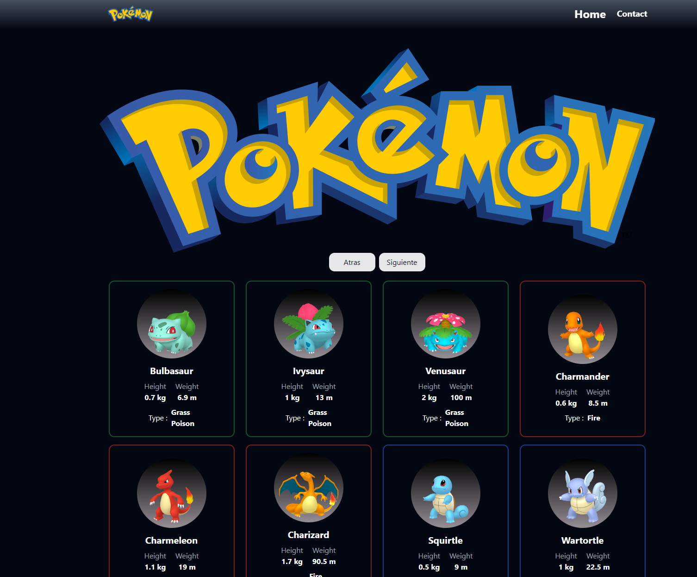
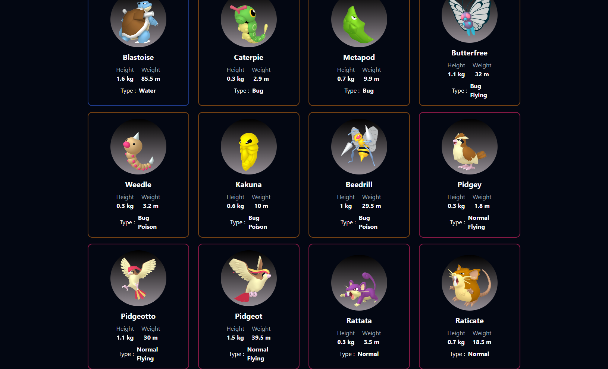
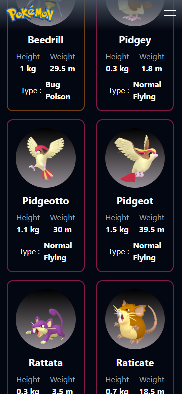
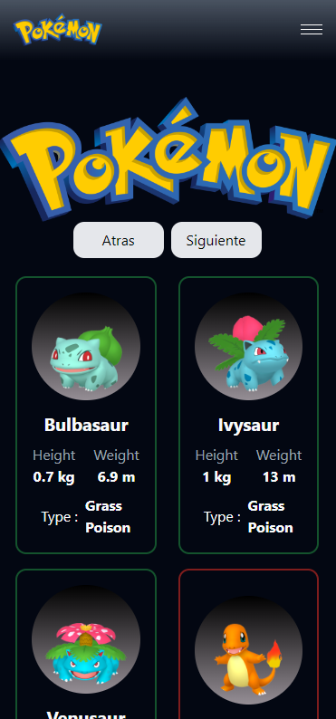

## Descripción

    La Siguiente aplicacion hace la visualizacion cartas de pokemones con sus respectivas imagenes, peso, estatura ya tipo de elemento a donde pertecen. con funcionalidad responsive design and mobile first design.
     

Se uso la Api [Poke Api](https://pokeapi.co/) para desarrollar

## Tecnologias:

- JavaScript
- Tailwind CSS
- HTML
- React (Vite)
---

<table>
<tr align="center">
<td align="center">

</td>
<td align="center">

</td>
</tr>
<tr>
<td align="center">

</td>
<td align="center">

</td>
</tr>

</table>

